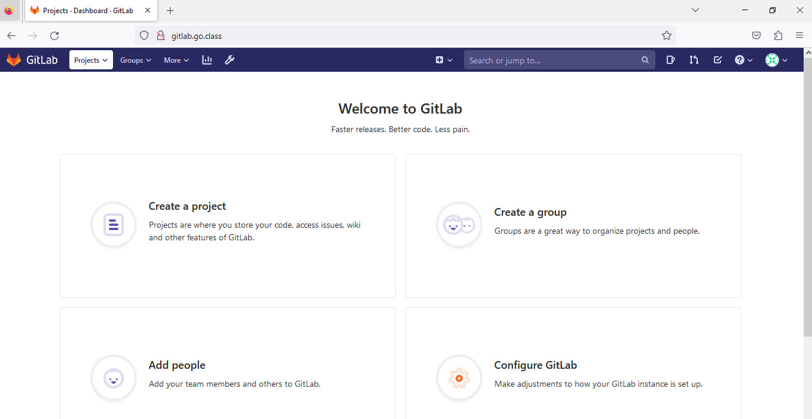
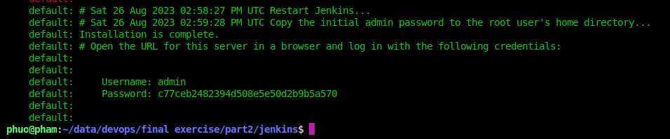
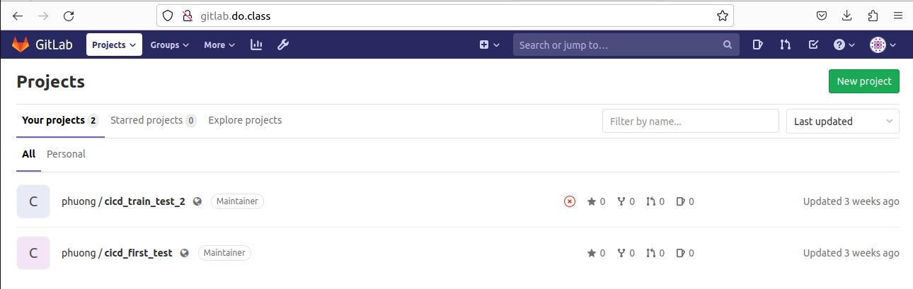

# Part 2
### 1. Deploy gitlab
- go to gitlab folder and execute
```shell
vagrant up
```
- configure hosts file to access:
```shell
sudo echo 192.168.56.100 gitlab.do.class >> /etc/hosts
```
- configure password
**Result**


### 2. Deploy jenkins
- goto jenkins folder and execute
```
vagrant up
```
- collect password from the output

- configure hosts file to access:
```shell
sudo echo 192.168.56.130 jenkins.do.class >> /etc/hosts
```
- Access gitlab.do.class and paste the collected password

- create account and this is the result

- add plugins:
    - Docker Plugin
    - Kubernetes Continuous Deploy Plugin
    - Gitlab API Plugin/ Gitlab Hook Plugin

**Result**

### Deploy k8s

[check out this file](./k8s.md)